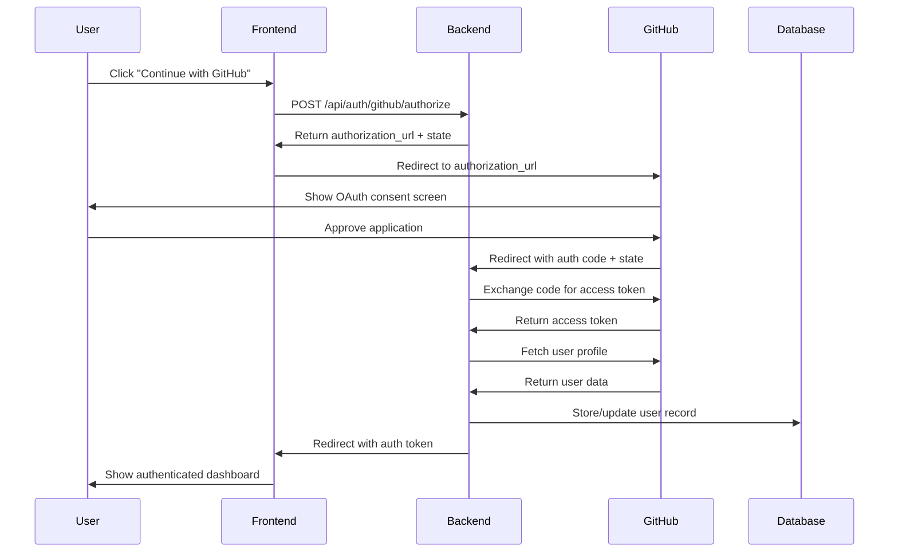

# GitHub OAuth Setup Guide

This guide walks through setting up a GitHub OAuth application for authentication in the Service Collections webapp.

## Overview

GitHub OAuth allows users to sign in using their GitHub accounts instead of creating separate credentials. This is particularly useful for developer-focused applications.

## Prerequisites

- A GitHub account with access to create OAuth applications
- Admin access to your GitHub organization (if setting up for an organization)

## Step-by-Step Setup

### 1. Navigate to GitHub Developer Settings

1. **Go to GitHub Settings**
   - Click your profile picture in the top-right corner
   - Select **"Settings"** from the dropdown

2. **Access Developer Settings**
   - Scroll down in the left sidebar
   - Click **"Developer settings"** at the bottom

3. **OAuth Apps Section**
   - Click **"OAuth Apps"** in the left sidebar
   - You'll see a list of existing OAuth applications (if any)

### 2. Create New OAuth Application

1. **Start New Application**
   - Click **"New OAuth App"** button (green button in top-right)

2. **Fill Application Details**
   ```
   Application name: Service Collections Webapp
   Homepage URL: https://mcp-vultr.l.supported.systems
   Application description: Service Collection management platform with Vultr integration
   Authorization callback URL: https://mcp-vultr.l.supported.systems/auth/github/callback
   ```

3. **Important Configuration Notes**
   - **Application name**: This appears to users during OAuth consent
   - **Homepage URL**: Must match your domain (no port numbers in production)
   - **Callback URL**: Critical - must match exactly what your application sends
   - **No localhost**: Use proper domain for production deployments

### 3. Obtain Credentials

After creating the application:

1. **Client ID**: Displayed immediately (public, safe to store in code)
2. **Generate Client Secret**:
   - Click **"Generate a new client secret"**
   - **Critical**: Copy immediately - you cannot view it again
   - Store securely (environment variables, not in code)

### 4. Configure Application Environment

Update your `.env` file with the credentials:

```bash
# GitHub OAuth Configuration (for FastMCP GitHubProvider)
GITHUB_ENABLED=true
GITHUB_CLIENT_ID=Ov23liTVLKrr3WuBcL6A
GITHUB_CLIENT_SECRET=your-actual-client-secret-here
GITHUB_REDIRECT_URI=https://mcp-vultr.l.supported.systems/auth/github/callback

# Set authentication mode
AUTH_MODE=github
```

### 5. Verify Configuration

1. **Check Domain Configuration**
   - Ensure `DOMAIN` in `.env` matches OAuth app homepage URL
   - No port numbers (`:8000`, `:4321`) in production URLs
   - Use Caddy reverse proxy for clean URLs

2. **Test OAuth Flow**
   - Navigate to your login page
   - Click "Continue with GitHub" button
   - Should redirect to GitHub authorization page
   - After approval, should redirect back with authorization code

## Security Best Practices

### Environment Variables
- **Never commit client secrets to Git**
- Use environment variables or secure secret management
- Different credentials for development/staging/production

### Redirect URI Security
- **Exact match required**: GitHub validates redirect URI exactly
- **No wildcards**: Cannot use `*.domain.com` patterns
- **HTTPS only**: Never use HTTP for redirect URIs in production
- **Path specific**: Include full path (`/auth/github/callback`)

### Scope Management
```javascript
// Minimal scopes for user authentication
scope: 'user:email read:user'

// Additional scopes if needed:
// - 'read:org' - Organization membership
// - 'repo' - Repository access (use carefully)
// - 'admin:org' - Organization administration
```

## Troubleshooting

### Common Issues

1. **"redirect_uri_mismatch" Error**
   - Exact URI mismatch between GitHub app config and application request
   - Check for trailing slashes, port numbers, protocol differences
   - Verify `.env` GITHUB_REDIRECT_URI matches GitHub app configuration

2. **"invalid_client" Error**
   - Incorrect Client ID or Client Secret
   - Check environment variable names and values
   - Regenerate client secret if compromised

3. **Button Not Visible**
   - Frontend may be checking auth configuration endpoint
   - Ensure backend `/api/auth/config` returns GitHub support status
   - Check browser console for JavaScript errors

4. **Port Numbers in URLs**
   - Remove port numbers from production redirect URIs
   - Use reverse proxy (Caddy) for clean URL routing
   - Development vs production environment configuration

### Debug Tools

1. **Check Authorization URL**
   ```bash
   # Decode URL parameters to verify configuration
   echo "https://github.com/login/oauth/authorize?client_id=..." | python -c "
   import sys
   from urllib.parse import urlparse, parse_qs
   url = sys.stdin.read().strip()
   parsed = urlparse(url)
   params = parse_qs(parsed.query)
   for key, value in params.items():
       print(f'{key}: {value[0]}')
   "
   ```

2. **Verify Environment Variables**
   ```bash
   # Check current configuration
   echo "GitHub Client ID: $GITHUB_CLIENT_ID"
   echo "Redirect URI: $GITHUB_REDIRECT_URI"
   echo "Auth Mode: $AUTH_MODE"
   ```

3. **Test Backend Endpoints**
   ```bash
   # Test auth config endpoint
   curl https://api.mcp-vultr.l.supported.systems/api/auth/config

   # Test GitHub authorize endpoint
   curl -X POST https://api.mcp-vultr.l.supported.systems/api/auth/github/authorize
   ```

## Development vs Production

### Development Environment
- Can use `localhost` or local domains
- Different OAuth app for development
- Relaxed security for testing

### Production Environment
- Proper SSL certificates required
- Real domain names only
- Secure secret management
- Rate limiting and monitoring

## Integration Architecture



## Related Documentation

- [FastMCP Authentication Providers](../backend/app/core/fastmcp_auth.py)
- [Frontend Auth Store](../frontend/src/entrypoint.ts)
- [Docker Compose Configuration](../docker-compose.yml)
- [Environment Configuration](../.env.example)

## Support

For issues with GitHub OAuth setup:
1. Check GitHub application configuration matches exactly
2. Verify environment variables are loaded correctly
3. Test with browser developer tools to see actual request/response
4. Check backend logs for detailed error messages